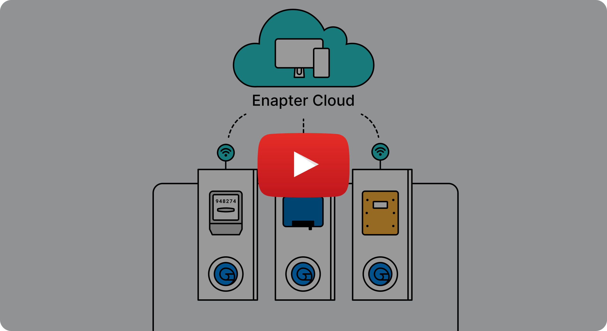

# :blue_book: What is Enapter Blueprint?

Enapter Blueprints is a technology that allows integration of various devices (electrolysers, power meters, inverters, batteries, sensors, etc.) into the Enapter Cloud platform with Lua scripts.

Blueprint technology uses a simple and unified device model that consists of:

- properties,
- telemetry,
- commands,
- alerts.

It describes which charts will be shown on a dashboard on mobile app or web, which commands can be executed, when to notify you about device alerts, etc. Using this model Enapter platform understands the capabilities of the device and how it can interact with other parts of an energy system.

[Blueprint Marketplace](htts://marketplace.enapter.com) is a collection of already developed Blueprints for most common energy devices as solar inverters, batteries, relays and [others](https://marketplace.enapter.com/blueprints/all). You are welcome to contribute into Enapter Blueprint Marketplace with your devices integrations.

Go through [the tutorial](https://developers.enapter.com/docs/) to learn about the blueprint concept and development workflow.
 

<a href="https://www.youtube.com/watch?v=1ErvFE6UHTY">
  
  <strong>📺 Watch Intro Video → </strong></a>

 

## Benefits of Integration

Integrating and monitoring of energy devices is first step for building your [Energy Management System (EMS)](https://en.wikipedia.org/wiki/Energy_management_system) or creating Energy Management Plan.

Energy management is the process of monitoring, controlling, and saving energy in a home or business. It is important for a number of reasons:

- Cost savings: Energy management can help reduce energy consumption, which can lower energy bills.
- Environmental impact: Reducing energy consumption can also help to reduce greenhouse gas emissions and other environmental impacts associated with energy production.
- Reliability: Proper energy management can help ensure that a home or business has a stable and reliable energy supply.
- Safety: Energy management can help identify and address any potential safety hazards related to energy use.

# Blueprint Marketplace Repository Overview

Top-level directories represent energy and industrial device types. Each directory contains a number of blueprints for specific device models.

The blueprint is an entity containing all aspects pertaining to device integration. It consists of two files:

- [`manifest.yml`](https://developers.enapter.com/docs/reference) describes your device interfaces (telemetry it sends, commands it executes, alerts it raises);
- `firmware.lua` implements these interfaces for the specific piece of hardware using the [Lua](https://www.lua.org) programming language and high-level platform APIs.

There are two types of hardware that can run your blueprint:

- a physical [Enapter UCM](https://handbook.enapter.com/modules/modules.html) that implements communication through [RS-485](https://handbook.enapter.com/modules/ENP-RS485/ENP-RS485.html), [CAN](https://handbook.enapter.com/modules/ENP-CAN/ENP-CAN.html), your own hardware based on [UCM Kit](https://go.enapter.com/ucmkit-enpkit) and other standards,
- a [virtual UCM](https://handbook.enapter.com/software/software.html#💎-virtual-ucm) – a software element of the [Enapter f 2.X](https://handbook.enapter.com/software/gateway_software/) (runs on an Intel-based server) that implements communication either over a local network (Ethernet) or by using a direct USB connection (serial communication).

Regardless of the underlying hardware, UCMs provide a runtime for Lua execution and expose APIs for [Enapter Cloud connection](https://developers.enapter.com/docs/reference/ucm/enapter), physical connections and protocols (e.g. [6-channel relay](https://developers.enapter.com/docs/reference/ucm/rl6), [RS-485](https://developers.enapter.com/docs/reference/ucm/rs485) serial communication, [Modbus RTU](https://developers.enapter.com/docs/reference/ucm/modbus), [Modbus TCP](https://developers.enapter.com/docs/reference/vucm/modbustcp), etc).

# How To Use These Blueprints

1. Select a hardware (UCM or gateway) suitable for communicating with your target device.
2. Provision your UCM to the Enapter Cloud using the mobile app or run a new virtual UCM on the Enapter Gateway.
3. Follow one of the options below to upload a blueprint to the UCM.

## → Use Enapter [Mobile App](https://handbook.enapter.com/software/mobile/) and [Blueprint Marketplace](https://marketplace.enapter.com)

1. Click `More` on main navigation pannel.
2. Click `Blueprint Marketplace`.
3. Find the required Blueprint and click `Install Blueprint`.
4. Select the UCM from the list and confirm.

## → Use [Web IDE](https://developers.enapter.com/docs/tutorial/what-you-need/#web-ide)

1. Open Blueprint tab in the Enapter Cloud.
2. Drag and drop the blueprint files into the IDE or copy and paste its contents.
3. Press "Select Device" and choose your UCM.
4. Press "Upload to" to upload the blueprint.

## → Use [Enapter CLI](https://developers.enapter.com/docs/tutorial/what-you-need/#command-line-interface)

1. Follow the steps described in [the tutorial](https://developers.enapter.com/docs/tutorial/what-you-need/#command-line-interface) to get the CLI tool and your API access token.
2. Switch the current directory to the desired blueprint.
3. Execute the command `enapter-cli devices upload --hardware-id UCMID --blueprint-dir .`. Substitute `UCMID` with your UCM ID.

After uploading the blueprint, your device data will appear on the device page in the Enapter Cloud and the mobile application.

# Blueprints Development & Contributing

Take a look at our [Contributing](./CONTRIBUTING.md) guideline.

# Community and Support

- &nbsp; Join our Discord community!
- &nbsp; Take a look on our documentation.
- &nbsp; Open thread on GitHub!
- &nbsp; Support us on ProducHunt with review.
