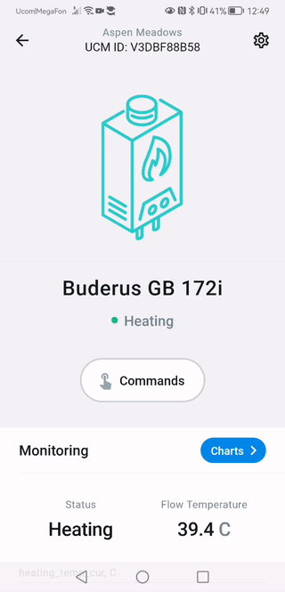
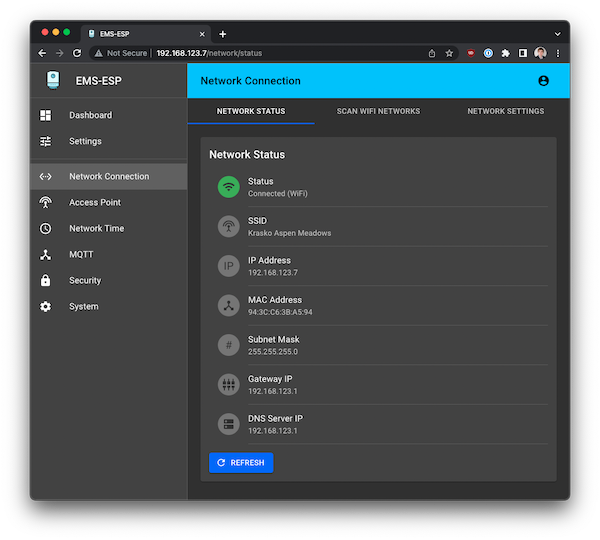
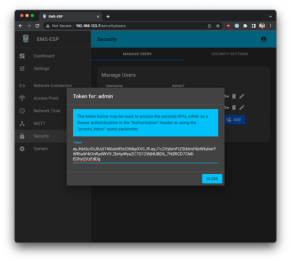
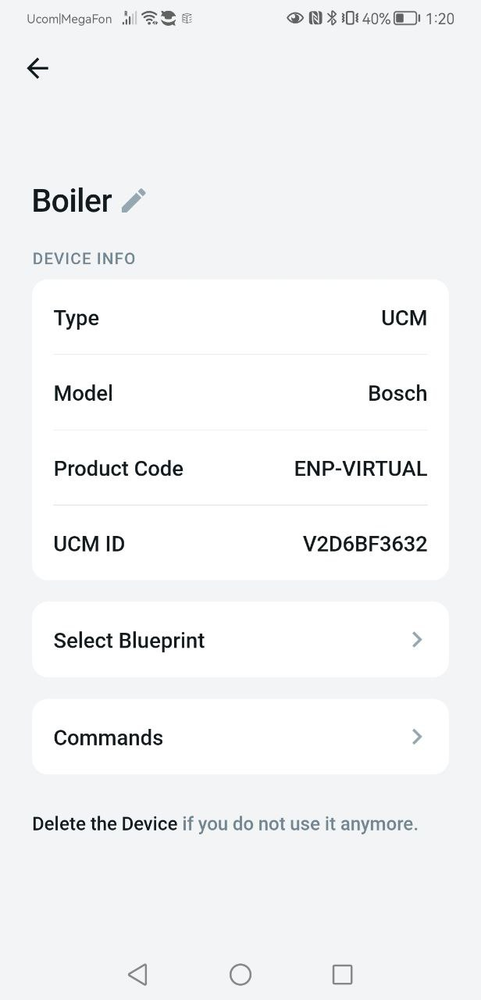
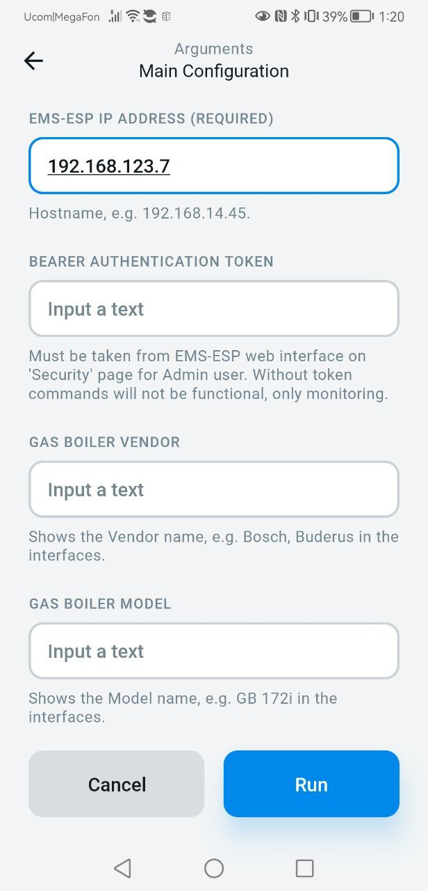

# Bosch, Buderus, Nefit, Junkers, Worcester and Sieger Gas Boiler (EMS)

This [Enapter Device Blueprint](https://github.com/Enapter/marketplace#blue_book-enapter-device-blueprints) integrates domestic gas boiler equipment from manufacturers like Bosch, Buderus, Nefit, Junkers, Worcester and Sieger using open-source solution [EMS-ESP](https://github.com/emsesp/EMS-ESP32). The Blueprint is running on [Enapter Virtual UCM](https://handbook.enapter.com/software/software.html#%F0%9F%92%8E-virtual-ucm). This Blueprint allow to monitor and control your gas boiler over Internet in secure way using Enapter Mobile App ans Enapter Cloud.

Originaly this Blueprint was developed especially for Buders GB 172i condensate gas boiler but should support any other compatible EMS bus boilers.

Please note that software is provided as is an neither Enapter or authors are responsible for any damage or risks caused by using of this software.



Main functionality:

- Fast and easy setup using configuration command (EMS-ESP IP, Bearer Token, Device Model) in Enapter Mobile App
- Domestic Hot Water mode and temperature configuration
- Heating mode and temperature configuration
- Monitoring of boiler operation in real-time
- Historical operaion overview using charts
- Blocking, Critical and Warning push notifications in human readable form
- Android and iOS application

## Requirements

1. **EMS-ESP / EMS bus Wi-Fi Gateway setup**

    You require setup **EMS-ESP** according to the [manual](https://bbqkees-electronics.nl/wiki/index.html).
    The EMS bus Wi-Fi Gateway must be connected to the same IP network where your Enapter Gateway is connected.

3. **Latest version of Enapter Gateway Software**

    Enapter Gateway Software must support Virtual UCM. Download latest version at [https://fw.enapter.com](https://fw.enapter.com).

## Running EMS-ESP

1. Save important parameters needed for further setup:

- EMS Bus Gateway **IP address**. You can find this at EMS-ESP Web interface **Network Connection** -> **Network Status**.

  

- Token for Admin user at **Security** page. This is needed for control using Mobile Application or Enapter Cloud. Ignore this if you don't need control.

  

4. Check your EMS-ESP API provides valid response with CURL from Enapter Gateway:

    ```zsh
    curl http://192.168.123.7/api/boiler
    ```

    You should get valid JSON as response.

If everything is fine you are ready to connect your device to Enapter Cloud!

## Connect to Enapter

1. Sign up to the Enapter Cloud using the [Web](https://cloud.enapter.com/) or mobile app ([iOS](https://apps.apple.com/app/id1388329910), [Android](https://play.google.com/store/apps/details?id=com.enapter&hl=en)).

2. Use the [Enapter Gateway](https://handbook.enapter.com/software/gateway/2.0.0/setup/) to run the Virtual UCM.

3. Create the [Enapter Virtual UCM](https://handbook.enapter.com/software/software.html#%F0%9F%92%8E-virtual-ucm).

4. Upload thie Blueprint using [Enapter Marketplace](https://marketplace.enapter.com) on your mobile device. Advanced users can upload using Web IDE or CLI by following [Developer Documentation](https://developers.enapter.com/docs/tutorial/uploading-blueprint/).

5. As soon as Blueprint will start the `EMS-ESP IP Address Not Configured` event will be triggered.

6. Navigate to `Settings`.

    

7. Click `Commands`.

8. In the  `Settings` section of the `Commands` screen click on `Main Configuration` command in the Enapter mobile or Web app to set main settings for your Virtual UCM:

    

    You need to set the following parameters you got during previous steps:

    - EMS-ESP IP Address

    - Bearer Authentication Token (Optional)

    - Boiler Model (Optional)

    - Boiler Vendor (Optional)

9. Press `Run` button

The status data should be available on your dashboard as well as you can control Boiler manually or automatic way with [Enapter Rules Engine](https://developers.enapter.com/docs/reference/rules/time)

## References

- [https://github.com/emsesp/EMS-ESP32](https://github.com/emsesp/EMS-ESP32)

- [https://bbqkees-electronics.nl/](https://bbqkees-electronics.nl/)

- [https://developers.enapter.com](https://developers.enapter.com)

- [Enapter's Discord Channel](https://discord.gg/TCaEZs3qpe)
