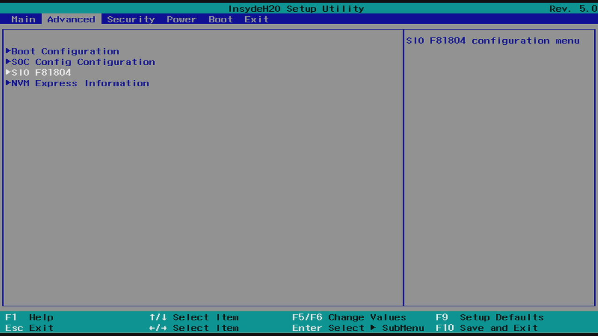
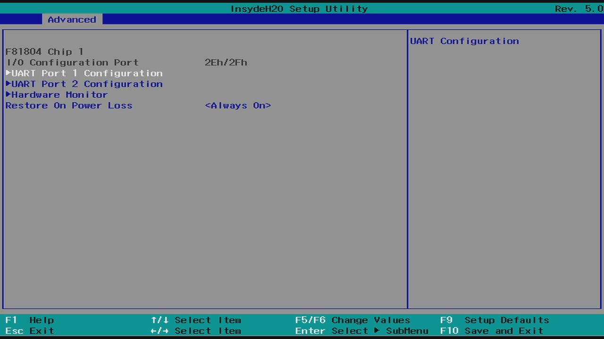
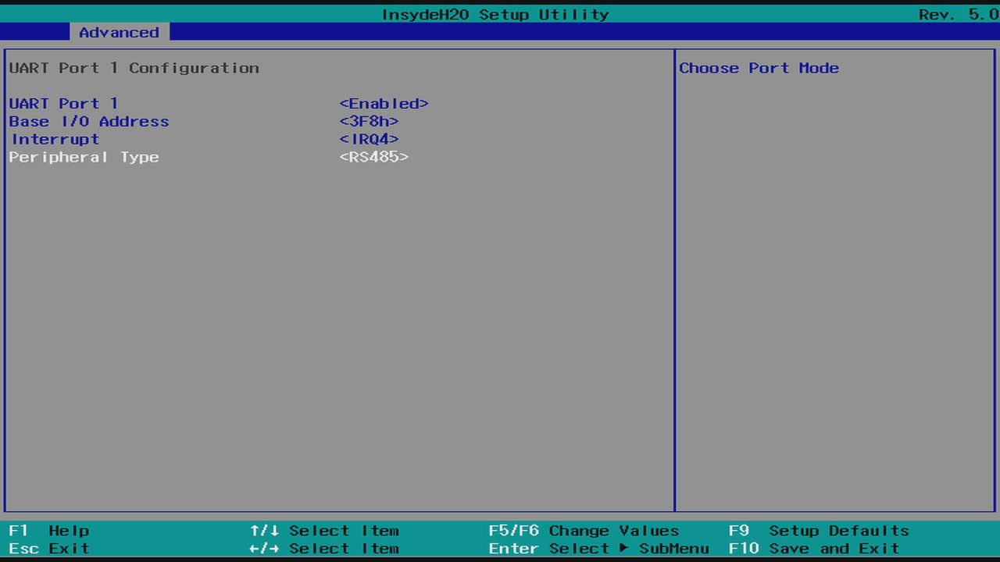

# Hunan Rika Electronic Tech RK100-02 for Arrakis MK4 IPC

This [Enapter Device Blueprint](https://go.enapter.com/marketplace-readme) integrates **Hunan Rika Electronic Tech RK100-02** - professional wind speed sensor (Anemometer) with [ModBus RTU](https://go.enapter.com/developers-enapter-modbus) over [RS-485 communication interface](https://go.enapter.com/developers-enapter-rs485) optimized for [Arrakis MK4 IPC](https://www.welotec.com/product/fanless-industrial-computer-arrakis-mk4-series/)

## Configuring RS485 Ports of Arrakis MK4

Hunan Rika Electronic Tech RK100-02 works over RS-485 port. Arrakis MK4 have universal ports which needs to be configured in BIOS of the IPC to required mode.

1. Reboot IPC and press `Del` button on the keyboard to enter BIOS setup utility.
2. Navigate to `Advanced` -> `SIO F81804`.

    

3. Select the port you would like to use for connection of gas sensor. `UART Port 1 (ttyS0)` or `UART Port 2 (ttyS1)`.

    

3. Set `Peripheral Type` to `RS485` and press `F10` on keyboard to save and exit configuration

    

## Connect to Enapter

- Sign up to the Enapter Cloud using the [Web](https://cloud.enapter.com/) or mobile app ([iOS](https://apps.apple.com/app/id1388329910), [Android](https://play.google.com/store/apps/details?id=com.enapter&hl=en)).
- Use the [Enapter ENP-RS485](https://go.enapter.com/handbook-enp-rs485) module for physical connection. See [connection instructions](https://go.enapter.com/handbook-enp-rs485-conn) in the module manual.
- [Add ENP-RS485 to your site](https://go.enapter.com/handbook-mobile-app) using the mobile app.
- [Upload](https://go.enapter.com/developers-upload-blueprint) this blueprint to ENP-RS485.

## References

- [Hunan Rika Electronic Tech RK100-02](https://www.rikasensor.com/rk100-02-wind-speed-sensor-wind-speed-detector.html);
- [Hunan Rika Electronic Tech RK100-02 Modbus Interface](https://github.com/Enapter/marketplace/issues/303).
- [Arrakis MK4 IPC](https://www.welotec.com/product/fanless-industrial-computer-arrakis-mk4-series/)
