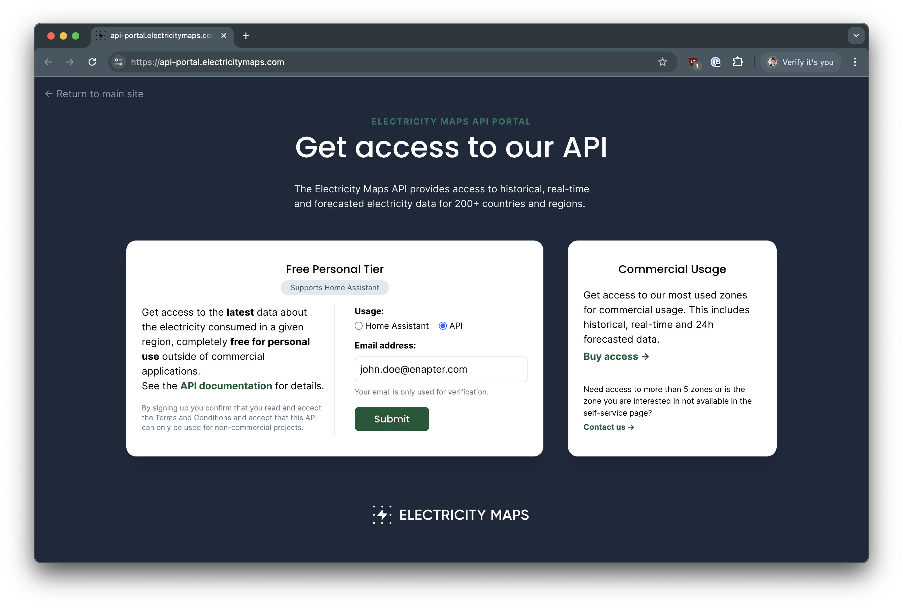
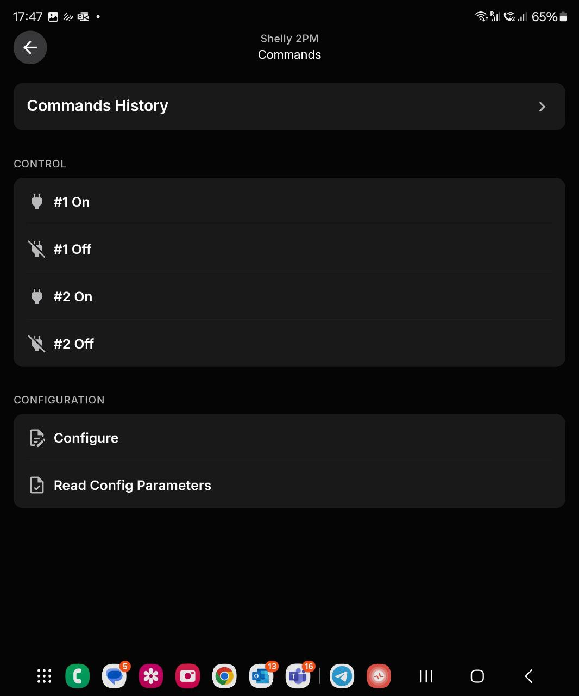
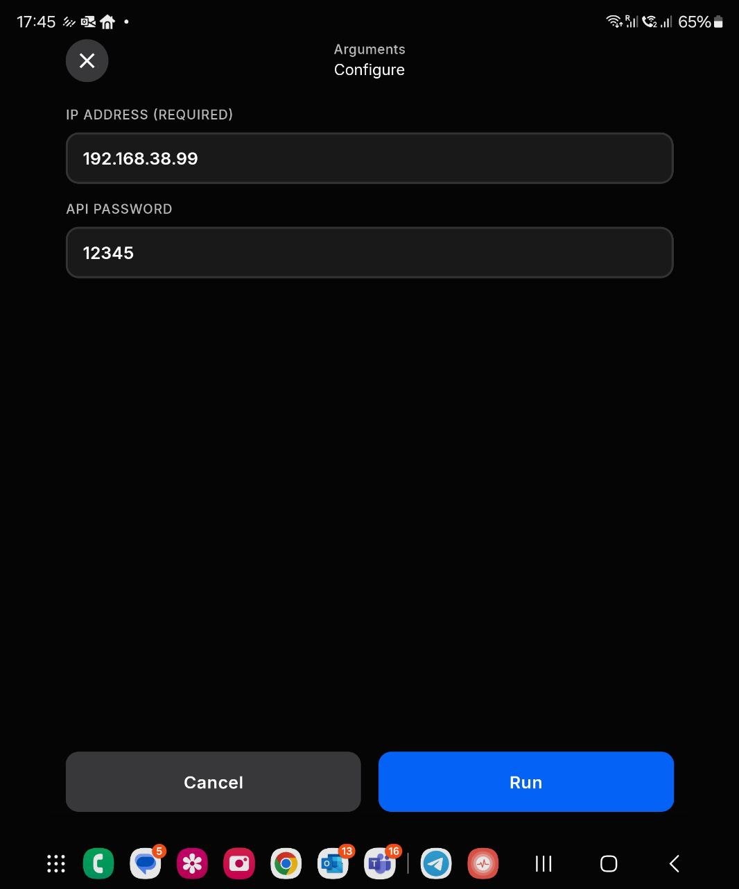

# Electricity Maps Cloud Service

This [Enapter Device Blueprint](https://go.enapter.com/marketplace-readme) integrates **Electricity Maps** API - platform that provides real-time and historical carbon intensity data for electricity grids around the world. The data from this API helps access detailed information about the carbon emissions associated with electricity generation in different regions to understand your Energy System carbon footprint and optimize usage of the loads.

This Blueprint provides following data for selected location (longitude, latitude):

- Carbon emissions in gramms per kWh

- Total power generation

- Total power consumption

- Percentage of fossil free energy

- Percentage of renewable energy

## Electricity Maps Cloud Service API Access

1. Navigate to [https://api-portal.electricitymaps.com/](https://api-portal.electricitymaps.com/)
2. Tick `API` and enter your e-mail address

    

3. Click `Submit` button.
4. Save your token

## Connect to Enapter

1. Sign up to the Enapter Cloud using the [Web](https://cloud.enapter.com/) or mobile app ([iOS](https://apps.apple.com/app/id1388329910), [Android](https://play.google.com/store/apps/details?id=com.enapter&hl=en)).

2. Use the [Enapter Gateway](https://handbook.enapter.com/software/gateway/2.0.0/setup/) to run the Virtual UCM.

3. Create the [Enapter Virtual UCM](https://handbook.enapter.com/software/software.html#%F0%9F%92%8E-virtual-ucm).

4. Upload thie Blueprint using [Enapter Marketplace](https://marketplace.enapter.com) on your mobile device. Advanced users can upload using Web IDE or CLI by following [Developer Documentation](https://developers.enapter.com/docs/tutorial/uploading-blueprint/).

5. As soon as Blueprint will start the `IP Address Not Configured` event will be triggered.

6. Click `Commands` on device screen.

    

7. On the commands list screen click on `Main Configuration` command:

    

    You need to set the following parameters:

    - Token

    - Longitude of your Energy System

    - Latitude of your Energy System

9. Press `Run` button

The status data should be available on your dashboard as well as you will be able to use the valuies in [Enapter Rules Engine](https://developers.enapter.com/docs/reference/rules/time)

## References

- [Electricity Maps](https://www.electricitymaps.com/)
- [Electricity Maps API](https://docs.electricitymaps.com/)
