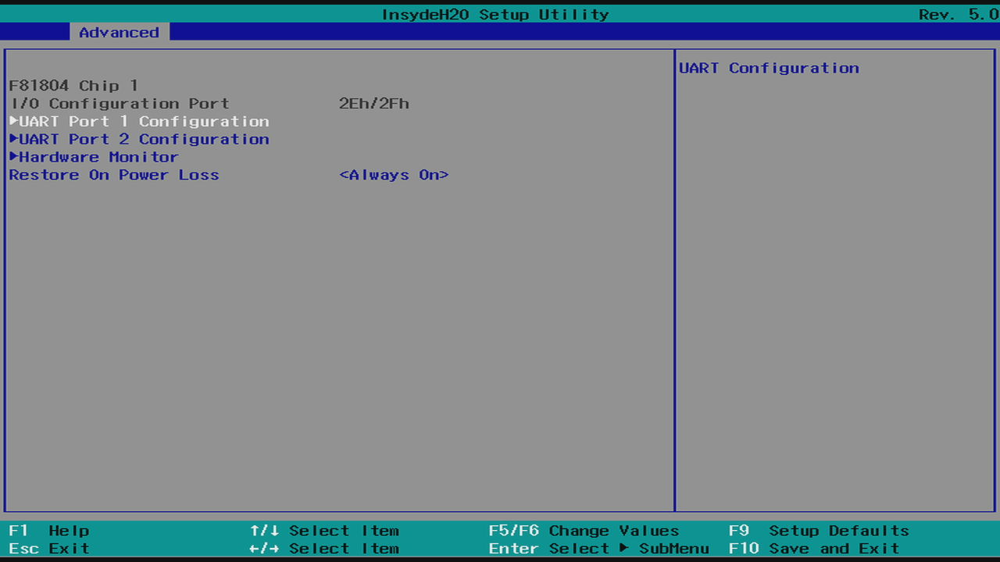
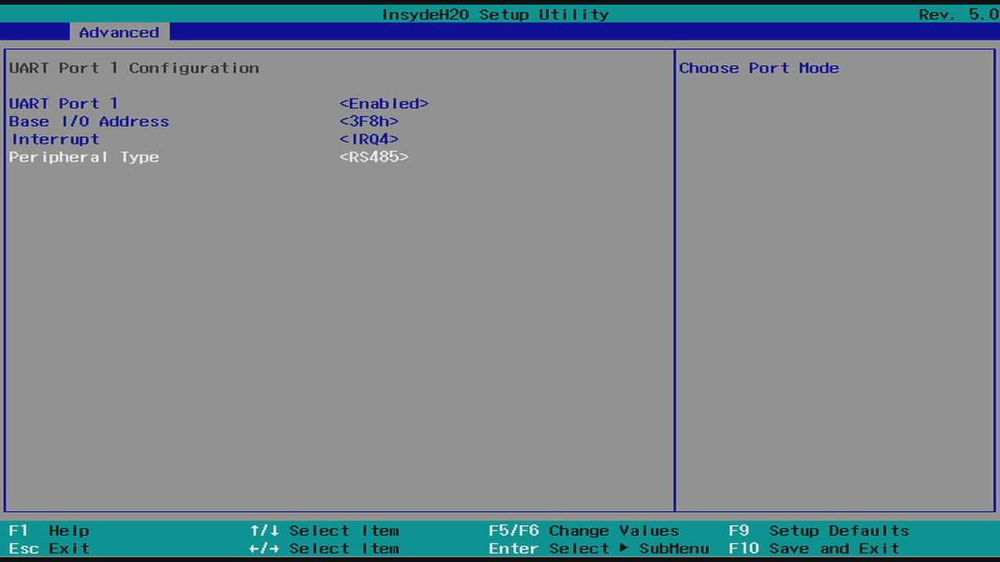

# EFOY H2 Cabinet N-Series for Arrakis MK4 IPC

This [Enapter Device Blueprint](https://go.enapter.com/marketplace-readme) integrates **EFOY H2 Cabinet N-Series** - indoor cabinet solution for EFOY Hydrogen fuel cells. Thanks to FC Controller it's possible to monitor and control via [ModBus RTU](https://go.enapter.com/developers-enapter-modbus) over [RS-485 communication interface](https://go.enapter.com/developers-enapter-rs485) optimized for [Arrakis MK4 IPC](https://go.enapter.com/arrakis-mk4-product-page).

## Configuring RS485 Ports of Arrakis MK4

EFOY H2 Cabinet N-Series works over RS-485 port. Arrakis MK4 have universal ports which needs to be configured in BIOS of the IPC to required mode.

1. Reboot IPC and press `Del` button on the keyboard to enter BIOS setup utility.
2. Navigate to `Advanced` -> `SIO F81804`.

    

3. Select the port you would like to use for connection of gas sensor. `UART Port 1 (ttyS0)` or `UART Port 2 (ttyS1)`.

    

3. Set `Peripheral Type` to `RS485` and press `F10` on keyboard to save and exit configuration

    

## Connect to Enapter

- Sign up to the Enapter Cloud using the [Web](https://cloud.enapter.com/) or mobile app ([iOS](https://apps.apple.com/app/id1388329910), [Android](https://play.google.com/store/apps/details?id=com.enapter&hl=en)).
- Setup [Enapter Gateway](https://go.enapter.com/handbook-gateway-setup) on your Arrakis MK4.
- [Create vUCM](https://go.enapter.com/handbook-mobile-app) using the mobile app.
- [Upload](https://go.enapter.com/developers-upload-blueprint) this blueprint to vUCM.

## References

- [EFOY H2 Cabinets product page](https://go.enapter.com/efoy-h2cabinets-product-page);
- [EFOY H2 Cabinet N-Series Datasheet](https://go.enapter.com/efoy-h2-cabinet-datasheet).
- [Arrakis MK4 IPC](https://go.enapter.com/arrakis-mk4-product-page)
