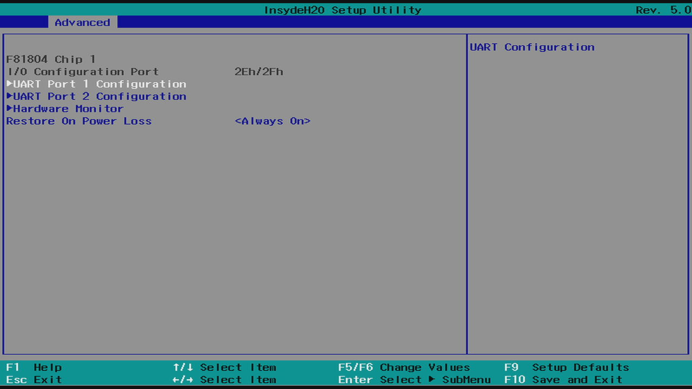
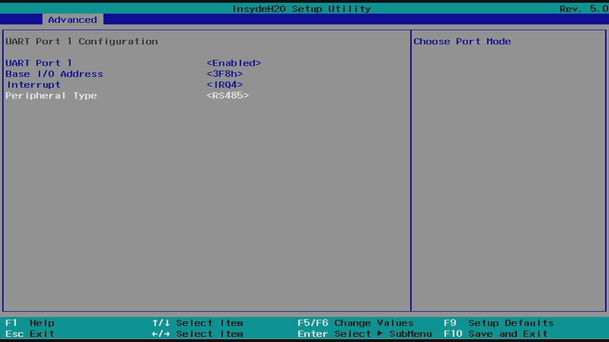

# EFOY H2 Cabinet N-Series

This [Enapter Device Blueprint](https://go.enapter.com/marketplace-readme) integrates **EFOY H2 Cabinet N-Series** - an indoor cabinet solution for EFOY Hydrogen fuel cells. Thanks to the FC Controller, it's possible to monitor and control the fuel cell system via [Modbus RTU](https://go.enapter.com/reference-lua-modbus) protocol over RS-485 communication.

## Connect to Enapter EMS

### Prerequisites

- Get a Lua runtime:
  - one of [Enapter ENP modules](https://go.enapter.com/hardware-modules)
  - or a [virtual UCM](https://go.enapter.com/software-ucms) on [Enapter Gateway](https://to.do)
- Connect to Enapter Gateway or login to Enapter account via:
  - [mobile application](https://to.do)
  - [enapter-cli or HTTP API](https://go.enapter.com/api-token)
- Create your online or local first Enapter Site via:
  - [mobile application](https://to.do)
  - [enapter-cli](https://to.do)
  - [HTTP API](https://go.enapter.com/http-api-create-site)

### Steps

- Wire your endpoint device with Enapter ENP module or Enapter Gateway PC.
- Add UCM to site via:
  - [mobile application](https://to.do)
- Only for virtual UCMs: [activate underlying hardware ports](https://go.enapter.com/virtual-ucm-ports)
- Configure [hardware ports](https://go.enapter.com/hardware-ports) via:
  - [mobile application](https://to.do)
  - [Enapter Gateway web interface](https://go.enapter.com/hardware-configuration)
- Create Lua Device via:
  - [mobile app](https://to.do)
  - [enapter-cli](https://to.do)
  - HTTP API:
    - [upload blueprint](https://go.enapter.com/http-api-upload-blueprint)
    - [provision lua](https://go.enapter.com/http-api-provision-lua-device)

## Configuring RS485 Ports of Arrakis MK4

EFOY H2 Cabinet N-Series works over RS-485 port. Arrakis MK4 have universal ports which needs to be configured in BIOS of the IPC to required mode.

1. Reboot IPC and press `Del` button on the keyboard to enter BIOS setup utility.
2. Navigate to `Advanced` -> `SIO F81804`.

3. Select the port you would like to use for connection of gas sensor. `UART Port 1 (ttyS0)` or `UART Port 2 (ttyS1)`.

4. Set `Peripheral Type` to `RS485` and press `F10` on keyboard to save and exit configuration

## References

- [EFOY H2 Cabinets product page](https://go.enapter.com/efoy-h2cabinets-product-page)
- [EFOY H2 Cabinet N-Series Datasheet](https://go.enapter.com/efoy-h2-cabinet-datasheet)
- [Arrakis MK4 IPC](https://go.enapter.com/arrakis-mk4-product-page)
