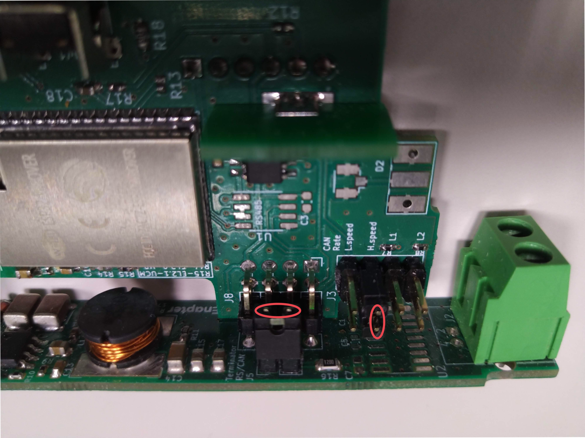

# Intelligent Energy FCM 801

This _Enapter Device Blueprint_ integrates **Intelligent Energy FCM 801** fuel cell module products for stationary and portable applications with [CAN bus](https://developers.enapter.com/docs/reference/ucm/can).

This blueprint collects the fuel cell telemetry, while the [`intelligent_energy_fcm_80x_rl6`](../intelligent_energy_fcm_80x_rl6) blueprint controls the fuel cell.

Use the [Enapter ENP-CAN](https://handbook.enapter.com/modules/ENP-CAN/ENP-CAN.html) module for physical connection. See the [connection instructions](https://handbook.enapter.com/modules/ENP-CAN/ENP-CAN.html#connection-examples) in the module manual.

## CAN bus Communication Interface Parameters

- Baud rate: `500` kbps.

## ENP-CAN Connection Diagram

## Troubleshooting

If the module is not receiving telemetry:

- Check the wiring and the resistor location according to [the diagram above](#enp-can-connection-diagram).
- Check the jumpers inside the ENP-CAN module (install if needed):
  - Dismount the antenna from the ENP-CAN module.
  - Remove the front cover.
  - Remove the back side of the module.
  - Carefully push the module control board down.
  - Install jumper `J5`, jumper `J3` H.speed or both according to the photo below:
    

Jumper locations photo

    

    

## References

- [Intelligent Energy FCM 801 User Manual](https://www.intelligent-energy.com/uploads/product_guides/FCM_801_User_Manual_2022_l6kbzNC.pdf)
