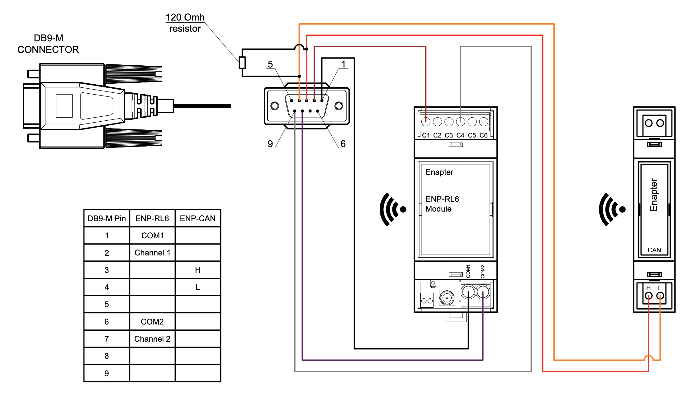
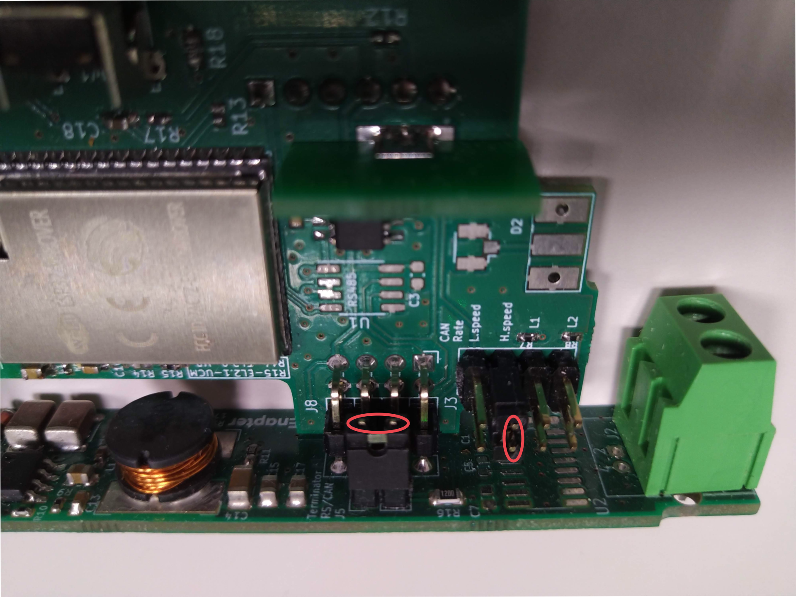

# Intelligent Energy FCM 804

This [Enapter Device Blueprint](https://go.enapter.com/marketplace-readme) integrates **Intelligent Energy FCM 804** fuel cell module products for stationary and portable applications with [CAN bus](https://go.enapter.com/developers-enp-can).

This blueprint collects the fuel cell telemetry, while the [`intelligent_energy_fcm_80x_rl6`](../intelligent_energy_fcm_80x_rl6) blueprint controls the fuel cell.

## Connect to Enapter

- Sign up to the Enapter Cloud using the [Web](https://cloud.enapter.com/) or mobile app ([iOS](https://apps.apple.com/app/id1388329910), [Android](https://play.google.com/store/apps/details?id=com.enapter&hl=en)).
- Use the [Enapter ENP-CAN](https://go.enapter.com/handbook-enp-can) module for physical connection. See [connection instructions](https://go.enapter.com/handbook-enp-can-conn) in the module manual.
- [Add ENP-CAN to your site](https://go.enapter.com/handbook-mobile-app) using the mobile app.
- [Upload](https://go.enapter.com/developers-upload-blueprint) this blueprint to ENP-CAN.

## ENP-CAN Connection Diagram

## Troubleshooting

If the module is not receiving telemetry:

- Check the wiring and the resistor location according to [the diagram above](#enp-can-connection-diagram).
- Check the jumpers inside the ENP-CAN module (install if needed):
  - Dismount the antenna from the ENP-CAN module.
  - Remove the front cover.
  - Remove the back side of the module.
  - Carefully push the module control board down.
  - Install jumper `J5`, jumper `J3` H.speed or both according to the photo below:
    

Jumper locations photo

    

    

## References

- [Intelligent Energy FCM 802/804 User Manual](https://go.enapter.com/intelligent-energy-user-manual)
