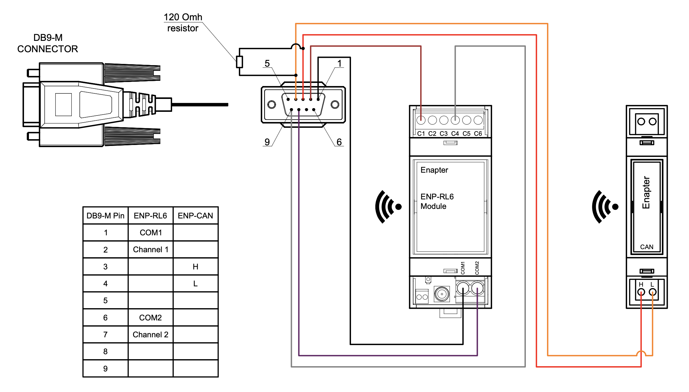
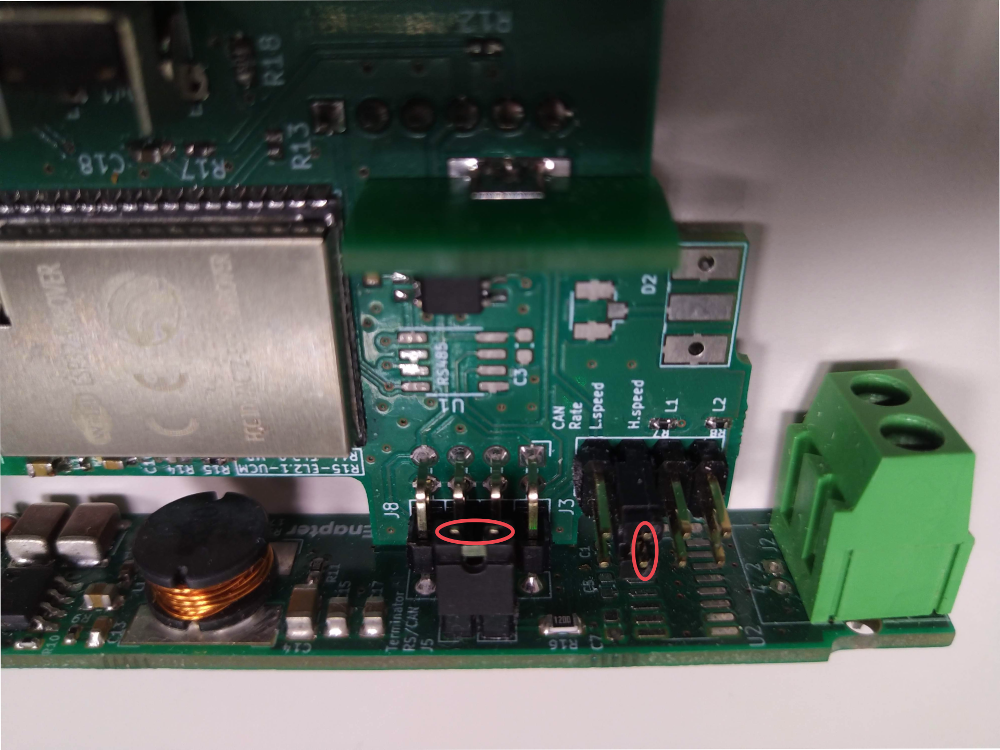

# Intelligent Energy FCM 804

The Intelligent Energy FCM 804 is a hydrogen fuel cell module for stationary and portable power applications. This blueprint integrates it into Enapter EMS over CAN bus using CAN interface and relay, providing full monitoring and power and start control.

## Connect to Enapter EMS

### Prerequisites

- You should have [access to Enapter EMS](https://go.enapter.com/how-to-use-enapter-ems).
- You should have a [Lua Runtime](https://go.enapter.com/handbook-vucm): use a Virtual UCM on the Enapter Gateway.
- You should have the following hardware modules:
  - [Enapter Gateway](https://go.enapter.com/handbook-gateway-setup)
  - [Enapter ENP-RL6](https://go.enapter.com/handbook-enp-rl6) — for relay-based power and start control
  - [Enapter ENP-CAN](https://go.enapter.com/handbook-enp-can) — for CAN bus communication

### Steps

1. Wire the fuel cell to the ENP-RL6 and ENP-CAN modules. See the [connection diagram below](#connection-diagram-example) and the connection instructions for [ENP-RL6](https://go.enapter.com/handbook-enp-rl6-conn) and [ENP-CAN](https://go.enapter.com/handbook-enp-can-conn).
2. Add the ENP-RL6 and ENP-CAN modules to your site using the [Enapter mobile app](https://go.enapter.com/handbook-mobile-app).
3. [Configure hardware ports](https://go.enapter.com/hardware-ports) on both modules.
4. [Upload](https://go.enapter.com/developers-upload-blueprint) the [Generic RL6 V3 blueprint](../../generic_io/rl6_v3) to ENP-RL6 and the [Generic CAN V3 blueprint](../../generic_io/can_v3) to ENP-CAN.
5. Configure ENP-CAN via Device Settings: set **Baud Rate** to 500 (or as required by your device), **Cache bucket size** to 10, **Cache TTL** to 10 seconds.
6. [Create a Lua Device](https://go.enapter.com/how-to-create-lua-device) using a Virtual UCM on the Gateway and [upload](https://go.enapter.com/developers-upload-blueprint) this blueprint to it.
7. [Configure](https://go.enapter.com/how-to-configure-devices) the blueprint via Device Settings:

- **CAN Index**: pre-configured at factory (usually 1), obtain from device vendor
- **CAN Bus Connection URI**: connection URI of the ENP-CAN module
- **Power Relay Connection URI**: connection URI of the ENP-RL6 module
- **Power Relay Channel**: relay channel number (1–6) connected to the FC power contact
- **Start Relay Connection URI**: connection URI of the ENP-RL6 module (may be the same)
- **Start Relay Channel**: relay channel number (1–6) connected to the FC start contact
- **Troubleshooting Mode**: enable to capture CAN 0x400 messages for analysis by Intelligent Energy support

## Connection Diagram Example

## Troubleshooting

If the module is not receiving telemetry:

- Check the wiring and resistor location according to [the diagram above](#connection-diagram-example)
- Check the jumpers inside the ENP-CAN module (install if needed):
  - Dismount the antenna from the ENP-CAN module
  - Remove the front cover
  - Remove the back side of the module
  - Carefully push the module control board down
  - Install jumper `J5`, jumper `J3` H.speed or both according to the photo below:
    

Jumper locations photo

    

    

## References

- [Intelligent Energy FCM 804 Product Page](https://www.intelligent-energy.com/our-products/stationary-power/fcm-804/)
