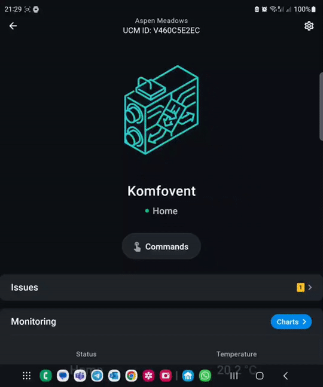

# Komfovent Air Handling Unit

This [Enapter Device Blueprint](https://github.com/Enapter/marketplace#blue_book-enapter-device-blueprints) integrates [Komfovent](https://www.komfovent.com/en/) Air Handling Unit with rotary heat recovery using PING 2 communication module with Modbus TCP. The Blueprint is running on [Enapter Virtual UCM](https://handbook.enapter.com/software/software.html#%F0%9F%92%8E-virtual-ucm). This Blueprint allow to monitor and control your AHU over Internet in secure way using Enapter Mobile App ans Enapter Cloud.

Originaly this Blueprint was developed especially for Komfovent REGO 600 with 1kW electric heater and C4 automation but should support any other compatible device and most likely direct connection with C4.1 and C5 automations.

Please note that software is provided as is an neither Enapter or authors are responsible for any damage or risks caused by using of this software.

Main functionality:

- Fast and easy setup using configuration command (Komfovent Ping2 IP Address, Electric Heater Power and Model) in Enapter Mobile App
- Start / Stop
- Air temperature setpoint
- Quick switch between operation modes: Away (Mode 1), Home (Mode 2), Forced Ventilation (Mode 3)
- Monitoring of AHU operation in real-time
- Historical operaion overview using charts
- Critical and Warning push notifications in human readable form
- Android and iOS application

## Requirements

1. **Komfovent PING 2 Module**

    You require setup **PING 2** according to the [manual](http://www.komfovent.com/en/downloads/PING2_manual_EN.pdf).
    The PING 2 module must be connected to the same IP network where your Enapter Gateway is connected.

3. **Latest version of Enapter Gateway Software**

    Enapter Gateway Software must support Virtual UCM. Download latest version at [https://fw.enapter.com](https://fw.enapter.com).

## Running Komfovent PING 2

1. Save important parameters needed for further setup:

- PING 2 **IP address**. You can find this at PING 2 Web interface **Settings** page.

  

If everything is fine you are ready to connect your device to Enapter Cloud!

## Connect to Enapter

1. Sign up to the Enapter Cloud using the [Web](https://cloud.enapter.com/) or mobile app ([iOS](https://apps.apple.com/app/id1388329910), [Android](https://play.google.com/store/apps/details?id=com.enapter&hl=en)).

2. Use the [Enapter Gateway](https://handbook.enapter.com/software/gateway/2.0.0/setup/) to run the Virtual UCM.

3. Create the [Enapter Virtual UCM](https://handbook.enapter.com/software/software.html#%F0%9F%92%8E-virtual-ucm).

4. Upload thie Blueprint using [Enapter Marketplace](https://marketplace.enapter.com) on your mobile device. Advanced users can upload using Web IDE or CLI by following [Developer Documentation](https://developers.enapter.com/docs/tutorial/uploading-blueprint/).

5. As soon as Blueprint will start the `Ping2 IP Address Not Configured` event will be triggered.

6. Navigate to `Settings`.

7. Click `Commands`.

8. In the  `Settings` section of the `Commands` screen click on `Main Configuration` command in the Enapter mobile or Web app to set main settings for your Virtual UCM:

    You need to set the following parameters you got during previous steps:

    - PING 2 IP Address

    - AHU Model (Optional)

    - Electric Heater Max Power (Optional, Default, 1000)

9. Press `Run` button

The status data should be available on your dashboard as well as you can control Boiler manually or automatic way with [Enapter Rules Engine](https://developers.enapter.com/docs/reference/rules/time)

## References

- [Komfovent Air Handling Units](https://www.komfovent.com/en/)

- [https://developers.enapter.com](https://developers.enapter.com)

- [Enapter's Discord Channel](https://discord.gg/TCaEZs3qpe)
