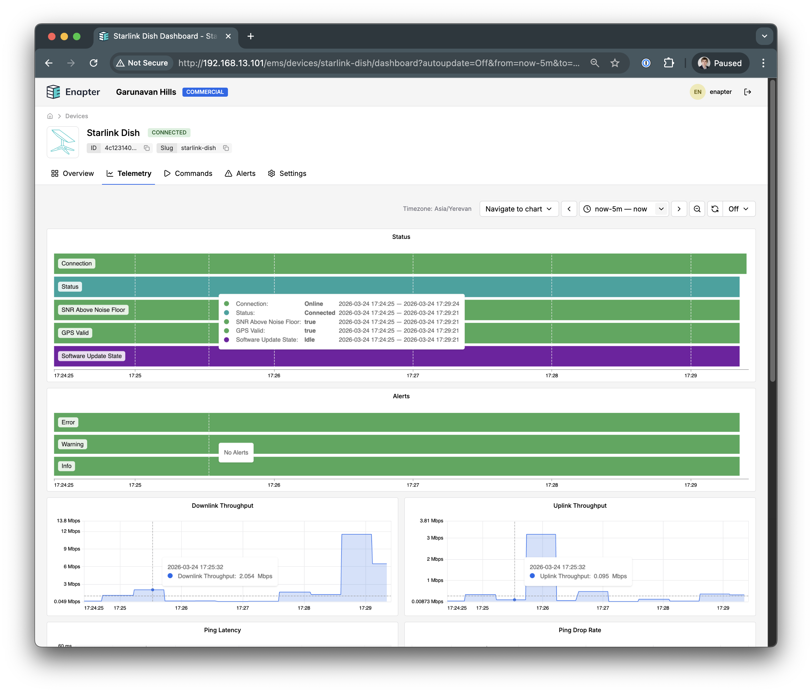

# SpaceX Starlink Gen4 Dish

This blueprint integrates with the **SpaceX Starlink Generation 4** satellite dish using its local gRPC API, providing real-time monitoring of connectivity, signal quality, obstruction statistics, and antenna pointing.

## Requirements

- Starlink Gen4 dish (`rev4_catapult` hardware)
- Enapter Gateway version **3.0.0-rc1** or later (required for HTTP/2 support)
- Device Running on Enapter Virtual UCM running on the same network as the dish
- Dish is accessible at `192.168.100.1:9200` (default Starlink local network)

## Network Setup

The Starlink dish creates a local network with the gateway at `192.168.100.1`. The Enapter Virtual UCM must be connected to the Starlink router (or directly to the dish Ethernet port) so that `192.168.100.1` is reachable.

No additional configuration is required — the dish IP address is fixed.

## API Protocol

The blueprint communicates with the dish using:

- **Protocol**: gRPC over HTTP/2 (cleartext)
- **Endpoint**: `http://192.168.100.1:9200/SpaceX.API.Device.Device/Handle`
- **Method**: `GetStatus` (polled every 30 seconds)

The request and response are encoded as Protocol Buffers. The blueprint implements a minimal protobuf binary decoder in Lua without external dependencies.

## Monitored Data

### Connectivity

| Telemetry           | Description                                                                |
| ------------------- | -------------------------------------------------------------------------- |
| Downlink Throughput | Current download speed (Mbps)                                              |
| Uplink Throughput   | Current upload speed (Mbps)                                                |
| Ping Latency        | Round-trip latency to SpaceX PoP (ms)                                      |
| Ping Drop Rate      | Packet loss percentage                                                     |
| Status              | Connectivity status from SpaceX service (Connected, Roam Restricted, etc.) |

### Signal & Antenna

| Telemetry             | Description                       |
| --------------------- | --------------------------------- |
| Obstruction           | Percentage of sky view blocked    |
| Antenna Azimuth       | Dish pointing azimuth (degrees)   |
| Antenna Elevation     | Dish pointing elevation (degrees) |
| SNR Above Noise Floor | Signal quality indicator          |

### System

| Telemetry             | Description                      |
| --------------------- | -------------------------------- |
| GPS Valid             | GPS lock status                  |
| GPS Satellites        | Number of GPS satellites tracked |
| Uptime                | Time since last reboot (seconds) |
| Software Update State | Firmware update progress         |

## Commands

| Command     | Description                        |
| ----------- | ---------------------------------- |
| Reboot Dish | Sends a reboot command to the dish |

## References

- [Starlink gRPC API tools](https://github.com/sparky8512/starlink-grpc-tools) — community reverse-engineered gRPC interface
- [Enapter Virtual UCM](https://go.enapter.com/vucm)
