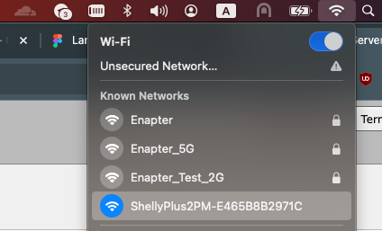
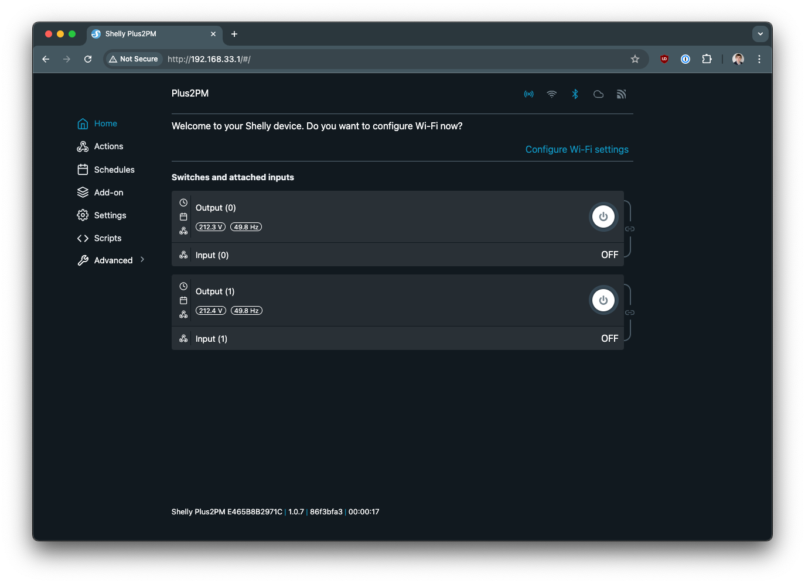
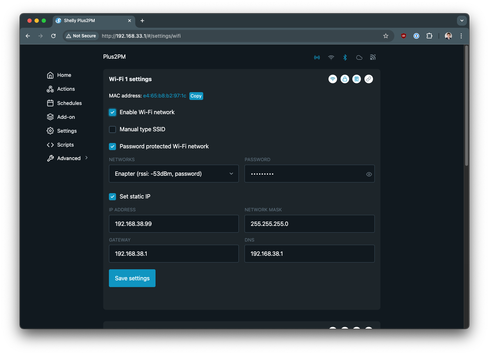
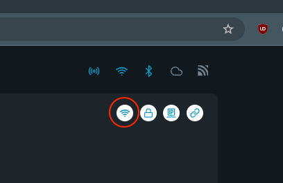
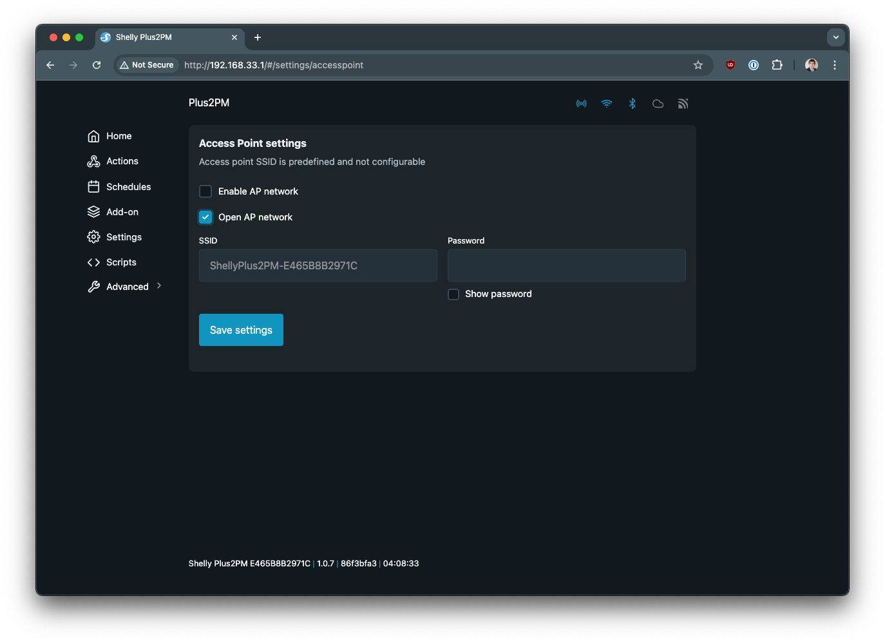
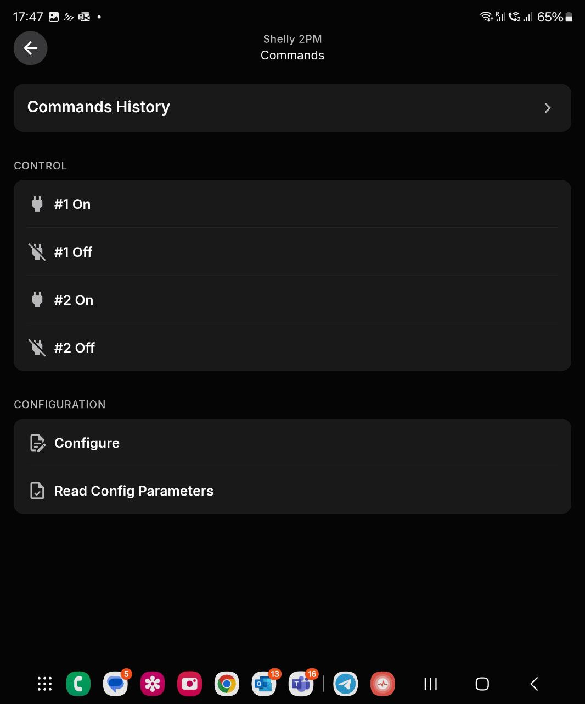
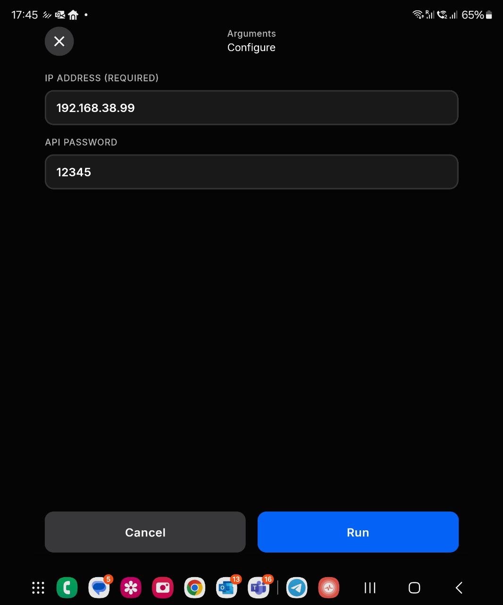

# Shelly Plus 2PM

This [Enapter Device Blueprint](https://go.enapter.com/marketplace-readme) integrates **Shelly Plus 2PMT** - power metering switch with 2x10A relays. It can be used to control external electrical load such as lights, pumps and valves. It also can be used as roller shutter. This blueprint runs on Virtual UCM and integrates using [RPC over HTTP API](https://shelly-api-docs.shelly.cloud/gen2/General/RPCProtocol/), therefore gateway and Shelly Plus 2PM module needs to be in one network. It also supports digest authentication.

## Configuring Shelly Plus 2 PM

1. Power On Module and wait when ShellyPlus2PM-*ID* Wi-Fi network will be discoverable in the air.
2. Conntect to your ShellyPlus2PM-*ID* Wi-Fi network using your computer.

    

3. Navigate to `http://192.168.33.1` using your favourite browser.

    

3. Navigate to `Settings`->`Wi-Fi` and set configuration of the network connection there. Select your Wi-Fi network from the list, put network password. It is also recommended to use static IPv4 settings.

    

4. Ensure that Wi-Fi icon changed to active status.

    

5. It is also recommended to diable Access Point by removing `Enable AP Network` checkbox in the `Settings`->`Access Point` menu.

    

## Connect to Enapter

1. Sign up to the Enapter Cloud using the [Web](https://cloud.enapter.com/) or mobile app ([iOS](https://apps.apple.com/app/id1388329910), [Android](https://play.google.com/store/apps/details?id=com.enapter&hl=en)).

2. Use the [Enapter Gateway](https://handbook.enapter.com/software/gateway/2.0.0/setup/) to run the Virtual UCM.

3. Create the [Enapter Virtual UCM](https://handbook.enapter.com/software/software.html#%F0%9F%92%8E-virtual-ucm).

4. Upload thie Blueprint using [Enapter Marketplace](https://marketplace.enapter.com) on your mobile device. Advanced users can upload using Web IDE or CLI by following [Developer Documentation](https://developers.enapter.com/docs/tutorial/uploading-blueprint/).

5. As soon as Blueprint will start the `IP Address Not Configured` event will be triggered.

6. Click `Commands` on device screen.

    

7. On the commands list screen click on `Main Configuration` command:

    

    You need to set the following parameters:

    - IP Address

    - Password (Optional)

9. Press `Run` button

The status data should be available on your dashboard as well as you will be able to use the valuies in [Enapter Rules Engine](https://developers.enapter.com/docs/reference/rules/time)

## References

- [Shelly Plus 2PM](https://www.shelly.com/en/products/shop/shelly-plus-2-pm)
- [Shelly Plus 2PM RPC over HTTP API](https://shelly-api-docs.shelly.cloud/gen2/0.14/Devices/ShellyPlus2PM/)
