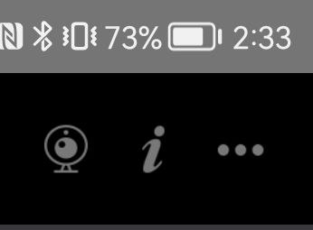
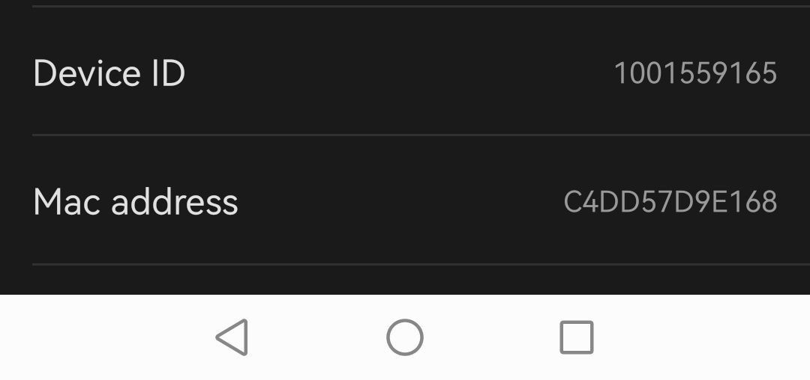
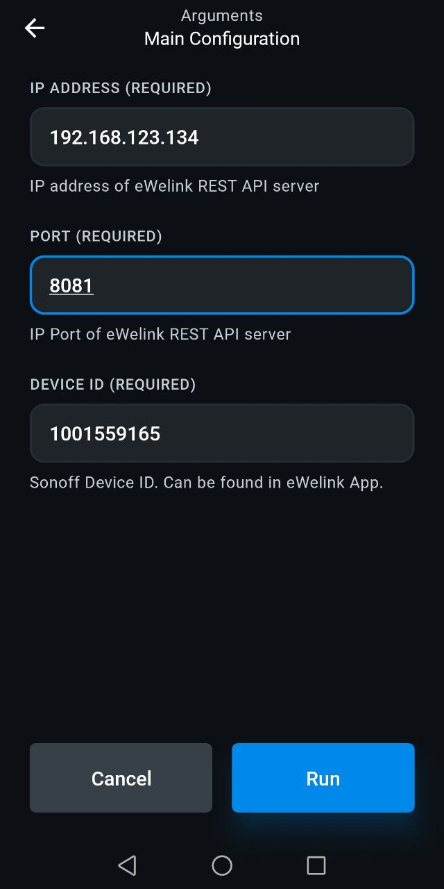

# Sonoff Dual R3 eWelink

This [Enapter Device Blueprint](https://github.com/Enapter/marketplace#blue_book-enapter-device-blueprints) integrates **Sonoff Dual R3** one channel relay via [eWelink REST API Server](https://github.com/DoganM95/Ewelink-Rest-Api-Server). The Blueprint is running on [Enapter Virtual UCM](https://handbook.enapter.com/software/software.html#%F0%9F%92%8E-virtual-ucm). This Blueprint allow to control both relays as well as monitor voltage, current and power.

## Requirements

1. **eWelink account**

    You require to have **email** and **password** used for login as well as **region**.

    The **eWelink** account can be created in the [eWelink Mobile App](https://sonoff.tech/ewelink/).

2. **Sonoff Device ID**
    You can find it in the eWelink app:

    1. Tap on Device.
    2. Click ... in top right corner.

        

    3. Scroll down to Device ID. Write it down for future use.

        

3. **Latest version of Enapter Gateway Software**

    Enapter Gateway Software must support Virtual UCM and Docker containers runtime.

## Running eWelink REST API Server

This Blueprint is using **eWelink REST API Server**. For more details visit it's page at GitHub - [https://github.com/DoganM95/Ewelink-Rest-Api-Server](https://github.com/DoganM95/Ewelink-Rest-Api-Server) and Docker Hub - [https://hub.docker.com/r/doganm95/ewelink-rest-api-server](https://hub.docker.com/r/doganm95/ewelink-rest-api-server)

At the moment of writing the instruction the original eWelink REST API server has no suppot for several channel devices. The patch is available at this repository [https://github.com/nkrasko/Ewelink-Rest-Api-Server](https://github.com/nkrasko/Ewelink-Rest-Api-Server).

The REST API is intermediate service from one sides connects to eWelink client API the same was as your mobile application and on the other side provide HTTP endpoint where you can get data of your devices in JSON format or execute commands for switches.

The beauty of this solution is possibility to use Enapter Energy Management toolkit and exisitng eWelink service.

In this example we will bild own container.

1. Clone repository

    ```zsh
    git clone https://github.com/nkrasko/Ewelink-Rest-Api-Server
    cd Ewelink-Rest-Api-Server
    ```

2. Build container

    ```zsh
    docker build -t nkrasko/ewelink-rest-api-server -f ./docker/Dockerfile .
    ```

    In case if you plan to run the docker container on Gateway (Option 2 below) you need to keep in mind that Enapter Gateway software is x86 based. This is important to know when you are building your docker container on other architecture, for example, Appe M1 (ARM) CPU.

    If that is the case, build docker container the following way

    ```zsh
    docker build --platform=linux/amd64 -t nkrasko/ewelink-rest-api-server -f ./docker/Dockerfile .
    ```

3. Run docker container

    - **Option 1.** Run docker container on general server.

        ```zsh
        docker run -d --restart unless-stopped \
            -p LOCAL_TCP_PORT:3000 \
            -e 'EWELINK_USERNAME=EMAIL' \
            -e 'EWELINK_PASSWORD=PASSWORD' \
            -e 'EWELINK_REGION=REGION' \
            -e 'SERVER_MODE=dev' \
            nkrasko/ewelink-rest-api-server
        ```

        Put the correct values for:

        - **EMAIL** - your eWelink email, for example, test@test.com
        - **PASSWORD** - your eWelink password
        - **REGION** - your eWelink Region:
        - Mainland China: CN
        - Asia: AS
        - Americas: US
        - Europe: EU
        - **LOCAL_TCP_PORT**: any free TCP port on which HTTP server will be listening. This port will be needed for Virtual UCM configurattion in next steps. For example, 8081.

        Check docker container is running and healthy by running command:

        ```zsh
        docker ps
        ```

        You should see something like:

        ```zsh
        CONTAINER ID   IMAGE                              COMMAND                  CREATED          STATUS          PORTS                    NAMES
        6261c5dd833f   nkrasko/ewelink-rest-api-server   "docker-entrypoint.s…"   33 minutes ago   Up 33 minutes   0.0.0.0:8081->3000/tcp   hungry_lewin
        ```

    ​    In above example, the docker container is running on TCP port 8081.

    - **Option 2.** Run docker container with docker-compose on Enapter Gateway 2.1.

        This option is helpful to minimize number of hardware used for running different custom services. Docker subsystem is running in stateless mode so every time container starts it is either requested from registry, built or taken from images cache. This example will explain how to put image to cache and write correct docker-compose file.

        Before continue ensure you are running [Gateway 2.1](https://handbook.enapter.com/software/gateway_software/whatsnew/2.1.html).

        **Export docker image from machine you've built it with docker build command.**

        ```zsh
        docker save nkrasko/ewelink-rest-api-server > nkrasko_ewelink-rest-api-server.tar
        ```

        **Copy docker image to temporary directory on your gateway with `scp`.**

        ```zsh
        scp nkrasko_ewelink-rest-api-server.tar enapter@enapter-gateway.local:/tmp
        ```

        `enapter-gateway.local` should be resolvable with mDNS in your LAN. If not, use IP address of your gateway. As password use the password you set during initial Gateway configuration.

        **Move image to docker images cache.**

        ssh to gateway with `ssh enapter@enapter-gateway.local` command. Run `bash` command to switch to the shell.

        ```zsh
        [enapter] $ bash
        enapter@gateway:~$
        ```

        become `root` with `sudo su -` command. `whoami` command is helpful to ensure your are root.

        ```zsh
        enapter@gateway:~$ sudo su -
        root@gateway:~$
        ```

        move image to docker images cache

        ```zsh
        root@gateway:~$ mv /tmp/nkrasko_ewelink-rest-api-server.tar /user/etc/docker-compose/images/
        ```

        **Edit docker compose configuration**

        you can use `vim` or `nano` text editors.

        ```zsh
        root@gateway:~$ vim /user/etc/docker-compose/docker-compose.yml
        ```

        Put the following content into the file:

        ```yaml
        version: "3"
        services:
            nkrasko-ewelink-api:
                image: localhost/nkrasko/ewelink-rest-api-server:latest
                ports:
                    - '0.0.0.0:LOCAL_TCP_PORT:3000'
                environment:
                    - 'EWELINK_USERNAME=EMAIL'
                    - 'EWELINK_PASSWORD=PASSWORD'
                    - 'EWELINK_REGION=EU'
                    - 'SERVER_MODE=dev'
        ```

        Ensure you have right indentation and put right values for:

        - **EMAIL** - your eWelink email, for example, test@test.com
        - **PASSWORD** - your eWelink password
        - **REGION** - your eWelink Region:
            - Mainland China: CN
            - Asia: AS
            - Americas: US
            - Europe: EU
        - **LOCAL_TCP_PORT**: any free TCP port on which HTTP server will be listening. This port will be needed for Virtual UCM configurattion in next steps. For example, 9292.

        **Start your configuration**

        ```zsh
        root@gateway:~$ systemctl restart enapter-docker-compose
        ```

        The start can take some time. Be patient.

        **Ensure your container is running**

        ```zsh
        root@gateway:~$ docker-compose -f /user/etc/docker-compose/docker-compose.yml ps
                        Name                              Command               State           Ports
        ------------------------------------------------------------------------------------------------------
        docker-compose_nkrasko-ewelink-api_1   docker-entrypoint.sh node  ...   Up ()   0.0.0.0:9292->3000/tcp
        root@gateway:~$
        ```

4. Check your API provides valid response with CURL from host where docker container runs:

    ```zsh
    curl http://127.0.0.1:8081
    ```

    You should get valid JSON as response.

If everything is fine you are ready to connect your device to Enapter Cloud!

## Connect to Enapter

1. Sign up to the Enapter Cloud using the [Web](https://cloud.enapter.com/) or mobile app ([iOS](https://apps.apple.com/app/id1388329910), [Android](https://play.google.com/store/apps/details?id=com.enapter&hl=en)).

2. Use the [Enapter Gateway](https://handbook.enapter.com/software/gateway/2.0.0/setup/) to run the Virtual UCM. If you are running eWelink REST API server on diiferent computer, ensure it is available from the Enapter Gateway.

3. Create the [Enapter Virtual UCM](https://handbook.enapter.com/software/software.html#%F0%9F%92%8E-virtual-ucm).

4. Upload thie Blueprint using [Enapter Marketplace](https://marketplace.enapter.com) on your mobile device. Advanced users can upload using Web IDE or CLI by following [Developer Documentation](https://developers.enapter.com/docs/tutorial/uploading-blueprint/).

5. As soon as Blueprint will start the `Module Not Configured` event will be triggered.

6. Navigate to `Settings` ().

7. Click `Commands`.

8. In the  `Settings` section of the `Commands` screen click on `Main Configuration` command in the Enapter mobile or Web app to set main settings for your Virtual UCM:

    

    You need to set the following parameters you got during previous steps:

    - IP Address of eWelink REST API server

    - IP Port

    - Device ID

9. Press `Run` button

The status data should be available on your **Sonoff Dual R3** dashboard as well as you can control your relay manually or automatic way with [Enapter Rules Engine](https://developers.enapter.com/docs/reference/rules/time)

## References

- [https://sonoff.tech](https://sonoff.tech)

- [https://hub.docker.com/r/doganm95/ewelink-rest-api-server](https://hub.docker.com/r/doganm95/ewelink-rest-api-server)

- [https://github.com/DoganM95/Ewelink-rest-api-server](https://github.com/DoganM95/Ewelink-rest-api-server)

- [https://developers.enapter.com](https://developers.enapter.com)

- [Enapter's Discord Channel](https://discord.gg/TCaEZs3qpe)
