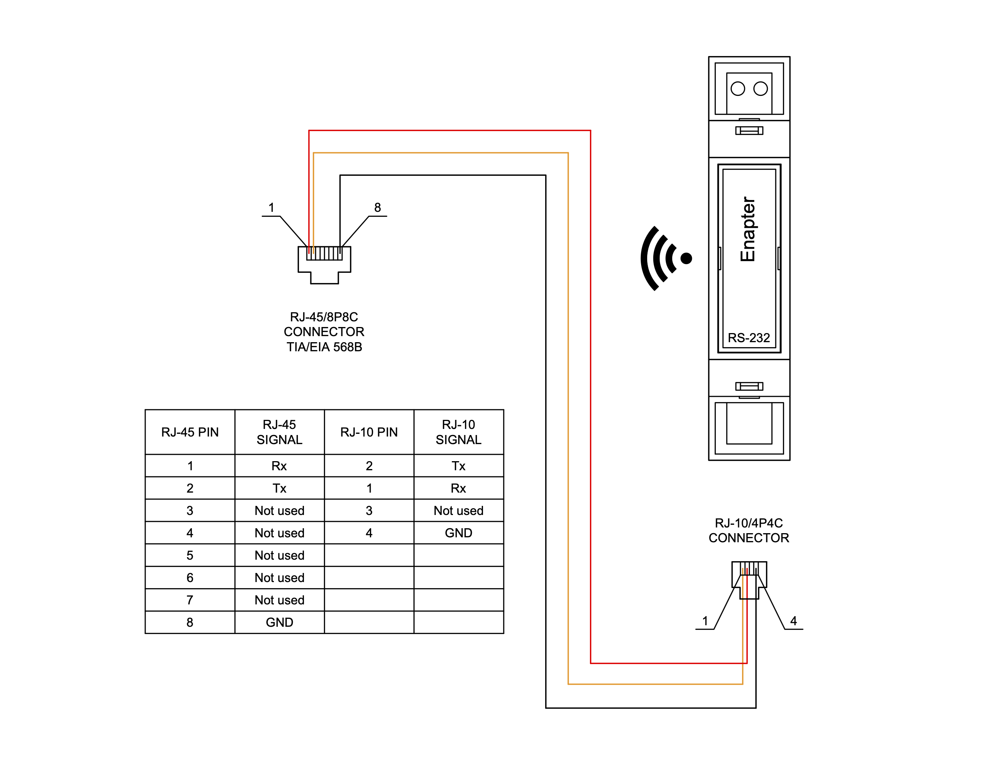
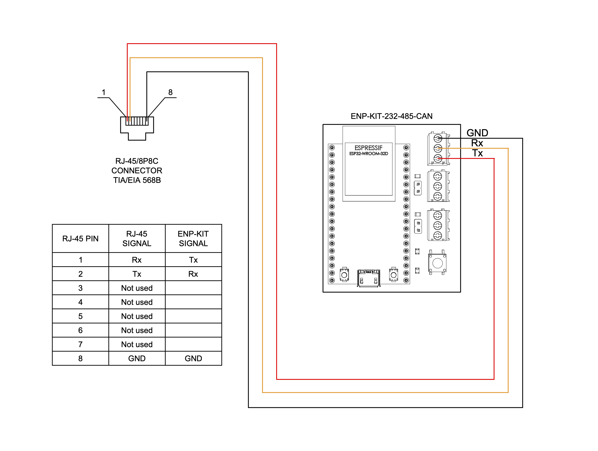

# Voltronic Power SCC-MPPT Charge Controller

This [Enapter Device Blueprint](https://go.enapter.com/marketplace-readme) integrates **Voltronic Power SCC-MPPT Charge Controller**. The Blueprint supports protocol over [RS-232 communication interface](https://go.enapter.com/developers-enapter-rs232).

This Blueprint supports visualization of the following metrics in Enapter Cloud and Mobile App:

- PV Input Voltage
- Battery Voltage
- Charging Current
- Charging Current 1
- Charging Current 2
- Charging Power
- Warnings and Errors

For detailed connection and operation instructions check [Voltronic Power Website](https://voltronicpower.com/en-US/Product/Detail/SCC-MPPT) site.

## Connect to Enapter

- Sign up to the Enapter Cloud using the [Web](https://cloud.enapter.com/) or mobile app ([iOS](https://apps.apple.com/app/id1388329910), [Android](https://play.google.com/store/apps/details?id=com.enapter&hl=en)).
- Use the [Enapter ENP-RS232](https://go.enapter.com/handbook-enp-rs232) or [Enapter ENP-KIT-232-485-CAN](https://go.enapter.com/enp-kit-232-485-can) communication module for physical connection.
- [Add communication module to your site](https://go.enapter.com/handbook-mobile-app) using the mobile app.
- [Upload](https://go.enapter.com/developers-upload-blueprint) this blueprint to the communication module.

## Physical Connection

For physical RS-232 connection with the inverter you will need:

- RS-232 communication module:
  - _Either_ Enapter [**ENP-RS232** communication module](https://handbook.enapter.com/modules/ENP-RS232/ENP-RS232.html),
  - _Or_ [**ENP-KIT-232-485-CAN** module](https://developers.enapter.com/docs/tutorial/ucm-kit/enp-kit-232-485-can) (check out UCM Kit [introduction](https://developers.enapter.com/docs/tutorial/ucm-kit/introduction) and simple [JLPCB ordering guide](https://developers.enapter.com/docs/tutorial/ucm-kit/ordering)) + ESP-32 development board.
- Communication cable with RJ45 connector on one side and plain wires on another side. You can use _RJ45 breakout connector_ to assemble such cable.

### ENP-RS232 Connection Diagram

### ENP-KIT-232-485-CAN Connection Diagram

## Troubleshooting

This is initial version of the Blueprint. In case you find out any issues, please contact us in [Discord](https://go.enapter.com/discord).

## References

- [Voltronic Power Website](https://voltronicpower.com/en-US/Product/Detail/SCC-MPPT)
