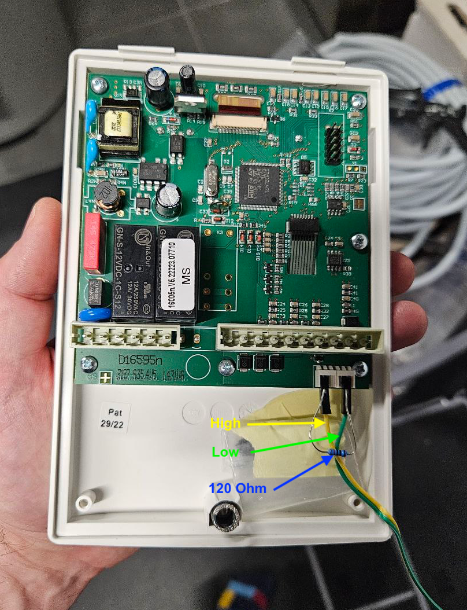

# SOREL MTDC - Temperature Difference Controller

This [Enapter Device Blueprint](https://go.enapter.com/marketplace-readme) integrates **SOREL MTDC** - “Medium” Temperature Difference Controller for midsize systems. It allows continious monitoring and data logging of temperature sensors installed in solar collecotror and buffer storage as well as relay signal status. Therefore it allows monitoring of standard use-case for thermal energy collection into a buffer tank, for example for hot water.

This blueprint runs on ENP-CAN.

## Connecting Sorel MTDC to ENP-CAN

1. In case you have only ENP-CAN and MTDC on the bus, you need to ensure that terminating resistors of 120 Ohm present on both ends of the bus. Internal terminating resistor on ENP-CAN can be enabled using jumper.
2. MTDC comes with 2 ports for CAN Bus. Unfortunatelly connector not included in the package therefore easiest way is to use dupont cables: use High pin on one connector and on Low pin on other.

3. Connect ENP-CAN module High and Low cables

4. Check the CAN Bus ID in the menu of SOREL MTDC controller LCD screen.

## Connect to Enapter

1. Sign up to the Enapter Cloud using the [Web](https://cloud.enapter.com/) or mobile app ([iOS](https://apps.apple.com/app/id1388329910), [Android](https://play.google.com/store/apps/details?id=com.enapter&hl=en)).

2. Connect ENP-CAN to Enapter Cloud or Enapter Gateway.

3. Upload thie Blueprint using [Enapter Marketplace](https://marketplace.enapter.com) on your mobile device. Advanced users can upload using Web IDE or CLI by following [Developer Documentation](https://developers.enapter.com/docs/tutorial/uploading-blueprint/).

4. As soon as Blueprint will start the `CAN Bus ID Not Configured` event will be triggered.

5. Click `Commands` on device screen.

6. On the commands list screen click on `Main Configuration` command:

You need to set the following parameters: - CAN Bus ID

7. Press `Run` button

The status data should be available on your dashboard as well as you will be able to use the valuies in [Enapter Rules Engine](https://developers.enapter.com/docs/reference/rules/time)

## References

- [SOREL MTDC](https://www.sorel.de/en/controller/tdc-solar-controls/mtdc/)
- [SOREL MTDC Manual](https://www.sorel.de/shared-files/69033/?MTDCv5_en.pdf)
- [SOREL CAN BUS Interface (SCBI) Description](https://github.com/arendst/Tasmota/discussions/20598)
