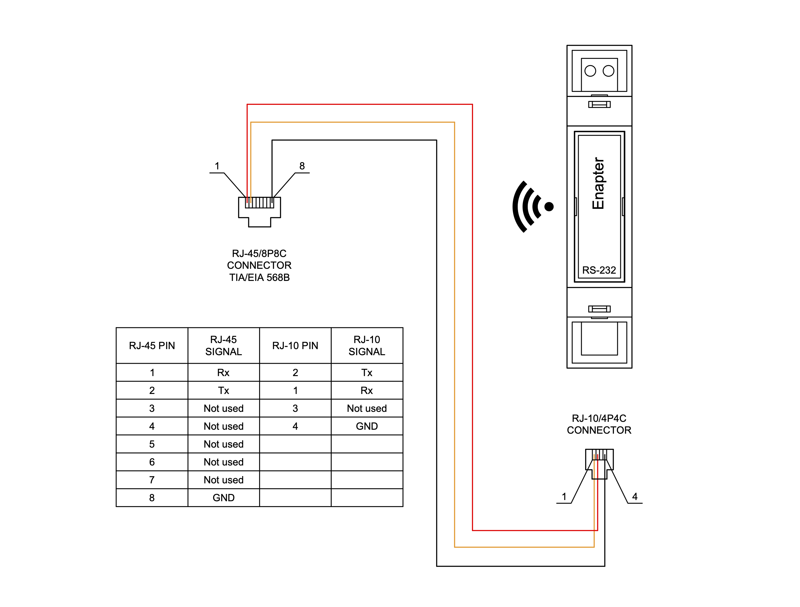
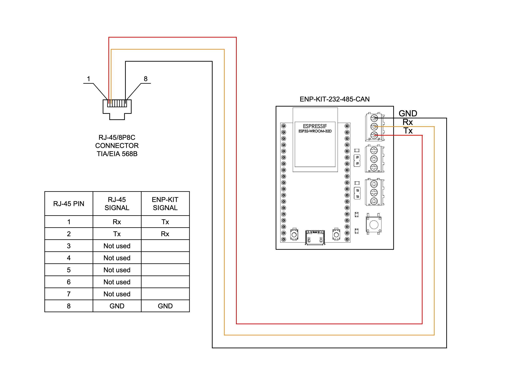

# MPP Solar Inverter (Single mode)

This [Enapter Device Blueprint](https://go.enapter.com/marketplace-readme) integrates **MPP Solar inverters** working in **single mode**. The blueprint supports WatchPower protocol over [RS-232 communication interface](https://go.enapter.com/developers-enapter-rs232).

For detailed connection and operation instructions check our [Watchpower Solar Inverter Monitoring](https://developers.enapter.com/docs/guides/monitoring/watchpower-solar-inverter-monitoring) guide.

## Connect to Enapter

- Sign up to the Enapter Cloud using the [Web](https://cloud.enapter.com/) or mobile app ([iOS](https://apps.apple.com/app/id1388329910), [Android](https://play.google.com/store/apps/details?id=com.enapter&hl=en)).
- Use the [Enapter ENP-RS232](https://go.enapter.com/handbook-enp-rs232) or [Enapter ENP-KIT-232-485-CAN](https://go.enapter.com/enp-kit-232-485-can) communication module for physical connection.
- [Add communication module to your site](https://go.enapter.com/handbook-mobile-app) using the mobile app.
- [Upload](https://go.enapter.com/developers-upload-blueprint) this blueprint to the communication module.

## Physical Connection

For physical RS-232 connection with the inverter you will need:

- RS-232 communication module:
  - _Either_ Enapter [**ENP-RS232** communication module](https://handbook.enapter.com/modules/ENP-RS232/ENP-RS232.html),
  - _Or_ [**ENP-KIT-232-485-CAN** module](https://developers.enapter.com/docs/tutorial/ucm-kit/enp-kit-232-485-can) (check out UCM Kit [introduction](https://developers.enapter.com/docs/tutorial/ucm-kit/introduction) and simple [JLPCB ordering guide](https://developers.enapter.com/docs/tutorial/ucm-kit/ordering)) + ESP-32 development board.
- Communication cable with RJ45 connector on one side and plain wires on another side. You can use _RJ45 breakout connector_ to assemble such cable.

### ENP-RS232 Connection Diagram

### ENP-KIT-232-485-CAN Connection Diagram

## Troubleshooting

- `Parallel mode detected` alert means that this blueprint **doesn't support inverters working in parallel**. Please upload [this blueprint](../mpp_solar_parallel).
- Check the wiring according to the diagram above.
- Check communication with inverter using official [Watchpower/Solarpower software](https://www.mppsolar.com/v3/download/). If it works, then this blueprint should work as well.

## References

- [MPP Solar homepage](https://go.enapter.com/mpp-solar-website)
