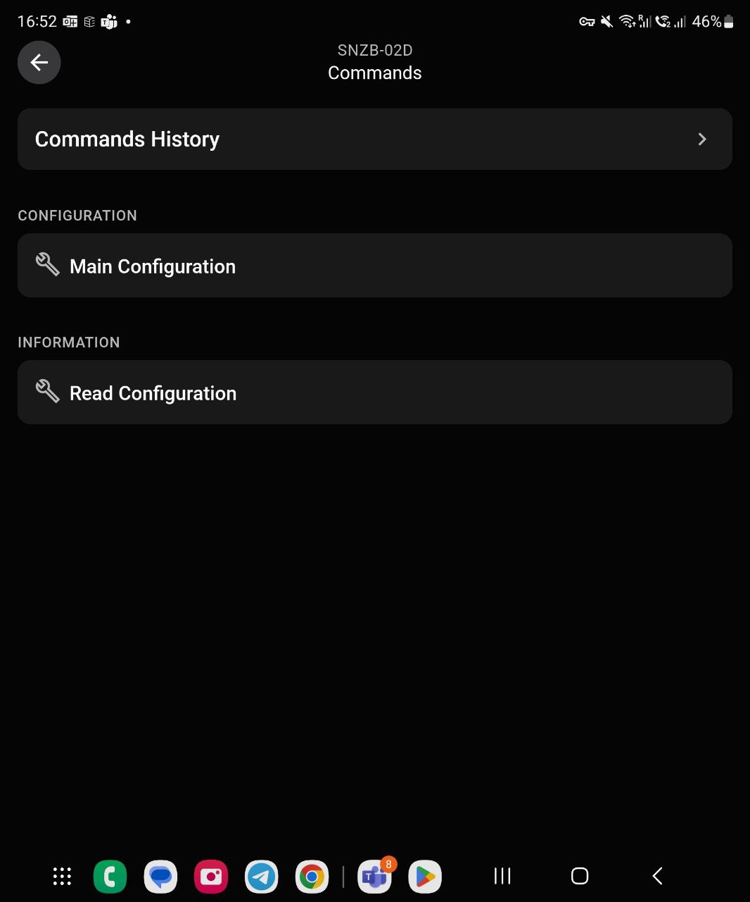
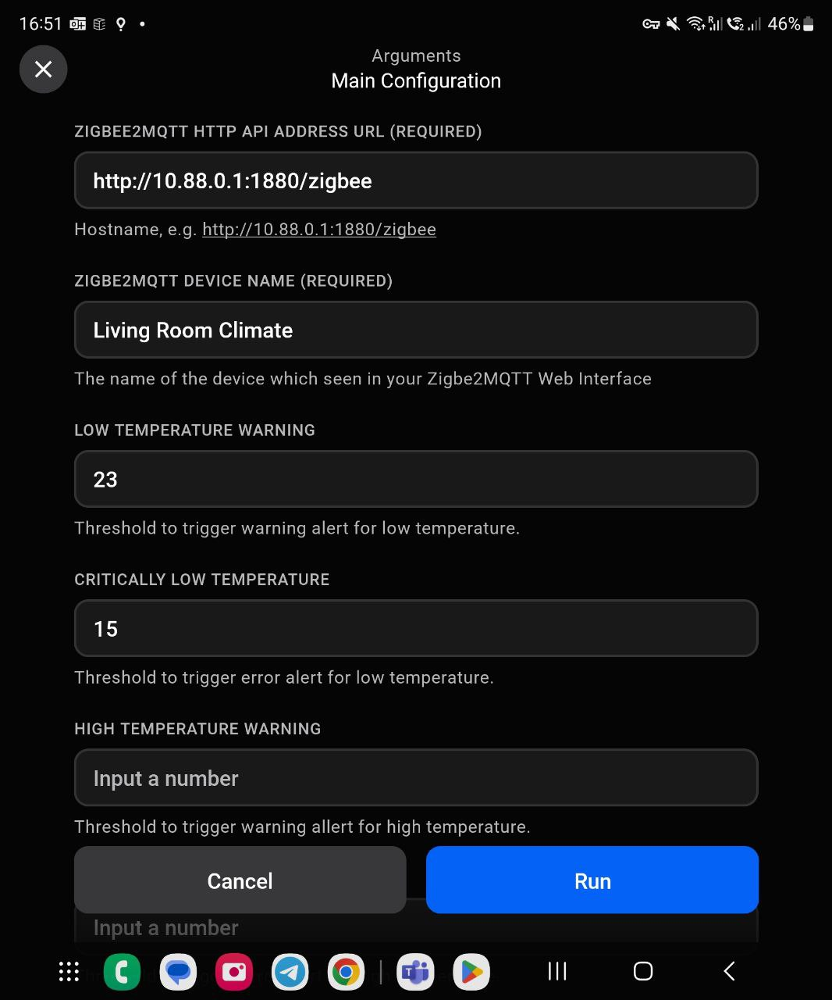

# Water Leak Sensor

This [Enapter Device Blueprint](https://github.com/Enapter/marketplace#blue_book-enapter-device-blueprints) integrates Zigbee water leak detection sensor manufactured by Xiaomi using open-source solutions [Zigbe2MQTT](https://www.zigbee2mqtt.io/) and [Node-RED](https://nodered.org/) running on Enapter Gateway as Docker containers. The Blueprint is intended to run on [Enapter Virtual UCM](https://handbook.enapter.com/software/software.html#%F0%9F%92%8E-virtual-ucm). This Blueprint allow to monitor water presence (leakage).

Please note that software is provided as is an neither Enapter or authors are responsible for any damage or risks caused by using of this software.

Main functionality:

- Fast and easy setup using configuration command (HTTP API, Device Name and Thresholds) in Enapter Mobile App
- Push notifications on triggering gas concentration thresholds.
- Real time and historical operation charts for Gas Concentration and Link Quality.
- Android and iOS application

## Requirements

1. **Zigbee2MQTT Setup**

It is recommended to have **Zigbee2MQTT** installed on Enapter Gateway as Docker Container. For detailed guide have a look at the [Enapter's Zigbee2MQTT installation guide here](https://developers.enapter.com/docs/guides/connection/zigbee-enapter-gateway).

More information can be found in the [official documentation](https://www.zigbee2mqtt.io/guide/installation/).

3. **Node-RED Setup**

Virtual UCM can communicate using HTTP API, however Zigbe2MQTT solution provides only MQTT interface. In order to make conversion from MQTT to HTTP it is convinient to use **Node-RED** as it has this as built-in functionality for this. The convinience of the Node-RED is also in `No Code` approach which makes setup fast and easy. For detailed guide have a look at the [Enapter's Node-RED installation guide here](https://developers.enapter.com/docs/guides/connection/enapter-gateway-node-red).

## Connect to Enapter

1. Sign up to the Enapter Cloud using the [Web](https://cloud.enapter.com/) or mobile app ([iOS](https://apps.apple.com/app/id1388329910), [Android](https://play.google.com/store/apps/details?id=com.enapter&hl=en)).

2. Use the [Enapter Gateway](https://handbook.enapter.com/software/gateway/2.0.0/setup/) to run the Virtual UCM.

3. Create the [Enapter Virtual UCM](https://handbook.enapter.com/software/software.html#%F0%9F%92%8E-virtual-ucm).

4. Upload thie Blueprint using [Enapter Marketplace](https://marketplace.enapter.com) on your mobile device. Advanced users can upload using Web IDE or CLI by following [Developer Documentation](https://developers.enapter.com/docs/tutorial/uploading-blueprint/).

5. As soon as Blueprint will start the `Zigbee2MQTT HTTP API Address Not Configured` event will be triggered.

6. Click `Commands` on device screen.

    

7. On the commands list screen click on `Main Configuration` command:

    

    You need to set the following parameters:

    - Zigbee2MQTT HTTP API Address

    - Device Name

    - Thresholds (not mandatory)

9. Press `Run` button

The status data should be available on your dashboard as well as you will be able to use the valuies in [Enapter Rules Engine](https://developers.enapter.com/docs/reference/rules/time)

## References

- [Zigbee2MQTT](https://www.zigbee2mqtt.io/)

- [Node-RED](https://nodered.org/)

- [https://developers.enapter.com](https://developers.enapter.com)

- [Enapter's Discord Channel](https://discord.gg/TCaEZs3qpe)
